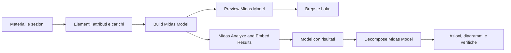

# Rhino2Midas

Plugin **Grasshopper per Rhino 8 / .NET 8 / Windows x64**, dedicato a **MIDAS Civil NX con API REST**. Riprende l'organizzazione di Rhino2SAP e Rhino2Straus: definizioni immutabili, Model unico, attributi, anteprima, Brep e bake, export, analisi, risultati incorporati e strumenti di interrogazione.

**434 componenti in 30 pannelli per argomento**, con icone a 24 px. Il catalogo include 345 componenti nativi di definizione e richiesta risultati.

Il trasferimento avviene direttamente tramite `/db`, `/doc` e `/post/TABLE`. **Non viene creato o importato alcun file MGT/MCT.** Civil classico senza API NX non è supportato.

[Componenti](docs/COMPONENTS.md) · [Corrispondenze con gli altri progetti](docs/PARITY.md) · [Preview](docs/PREVIEW.md) · [Analisi e risultati](docs/ANALYSIS-RESULTS.md) · [Collaudo e limiti](docs/VALIDATION.md)

## Installazione

1. Usare `artifacts/Rhino2Midas.zip`, oppure eseguire `./build.ps1`.
2. Copiare **l'intera cartella Rhino2Midas del pacchetto** in Grasshopper → File → Special Folders → Components Folder. Sono necessari il `.gha` e gli assembly Core e Api.
3. Sbloccare i file scaricati e riavviare Rhino 8.27 o successivo in modalità .NET 8.
4. In Civil NX aprire **Apps → API Settings**, ottenere Base URL e MAPI-Key e attivare **Connect**. Civil NX deve essere sullo stesso computer di Rhino per il salvataggio e la verifica dei file.
5. Inserire `Midas API Connection` in Grasshopper, tasto destro → **Configure Civil NX API**. La chiave resta in memoria fino alla chiusura di Rhino. In alternativa impostare `MIDAS_API_URL` e `MIDAS_API_KEY` nell'ambiente del processo Rhino.

Non distribuire chiavi nei pannelli o nei file `.gh`. Il plugin non le salva nei propri archivi. Le librerie proprietarie Rhino/Grasshopper/MIDAS non sono incluse nel pacchetto.

## Flusso



I componenti di modellazione non richiedono Civil aperto. Collegare definizioni di materiale e proprietà agli elementi conserva le dipendenze; gli ingressi accettano anche ID numerici, purché le definizioni corrispondenti confluiscano nel Model. `Build Midas Model` salda i nodi impliciti entro la tolleranza e conserva i nodi espliciti, anche coincidenti. Gli ID di nodi, elementi e link elastici appartengono a spazi distinti. Gli attributi producono copie e invalidano i risultati.

`Merge Midas Models` richiede unità e tolleranza uguali e ID compatibili. Una dipendenza condivisa non raddoppia i carichi; contributi creati separatamente restano distinti. Gli ID non vengono rinumerati automaticamente: i riferimenti degli oggetti API avanzati devono rimanere coerenti.

Usare `Midas Cantilever Example` per l'esempio offline, oppure leggere [examples/Cantilever.model.json](examples/Cantilever.model.json) con Read File → Midas Model from JSON. La visualizzazione espone solidi chiusi anche a preview spenta.

## Export e calcolo

Collegare un Model a `Export Midas Civil Model` oppure `Midas Analyze and Embed Results`, impostare un percorso `.mcb` e portare `Run` da false a true. Salvare prima il proprio lavoro in Civil e abilitare **Replace active document**: l'API crea un nuovo documento nella sessione Civil connessa. **Overwrite** è disattivato per default.

Le modifiche agli input non avviano automaticamente il solver. Il calcolo è sincrono; il timeout HTTP è di 30 minuti. Non vengono ripetute automaticamente le chiamate fallite. Dopo un timeout controllare Civil, dove l'operazione può essere ancora in corso. Un errore può lasciare il documento Civil parzialmente compilato; il salvataggio nativo non è una transazione atomica.

Il collaudo numerico sul solver Civil NX **non è stato eseguito in questa sessione**, perché manca una connessione API configurata. Build, test gestiti e verifiche Rhino sono documentati in [VALIDATION](docs/VALIDATION.md).

## Unità

Tutti gli ingressi dimensionali usano le unità del Model. Default **KN, M, KJ, C**. Le coordinate Rhino non vengono convertite. Modulo elastico e tensioni: F/L²; peso specifico: F/L³; carichi distribuiti: F/L; momenti: F·L. Le risultanti piastra per unità di lunghezza hanno unità F/L e F·L/L. Le masse usano unità coerenti F·s²/L. Gli angoli di orientamento sono in gradi, le rotazioni di risultato in radianti.

In assenza di una definizione `STYP`, viene impostata una struttura 3D con gravità 9,806 m/s² convertita nell'unità di lunghezza e senza trasformare automaticamente il peso proprio in massa. Collegare il componente nativo Structure Type per impostazioni diverse.

## Sviluppo

```powershell
./build.ps1 -RhinoSmoke
./tools/Update-ApiCatalogue.ps1
./tools/Generate-Components.ps1
dotnet run --project Rhino2Midas.Tests -c Release
dotnet run --project tools/PluginSmoke -c Release
```

Il catalogo è ricavato dal [manuale ufficiale MIDAS API](https://support.midasuser.com/hc/en-us/articles/33016922742937-MIDAS-API-Online-Manual). Ogni componente nativo restituisce il link della propria pagina. I valori iniziali sono **esempi della documentazione**, da adattare agli ID, alle unità e alle dipendenze del modello; non sono valori raccomandati per il progetto. Le funzioni disponibili dipendono dalla versione e dalla licenza Civil NX.
