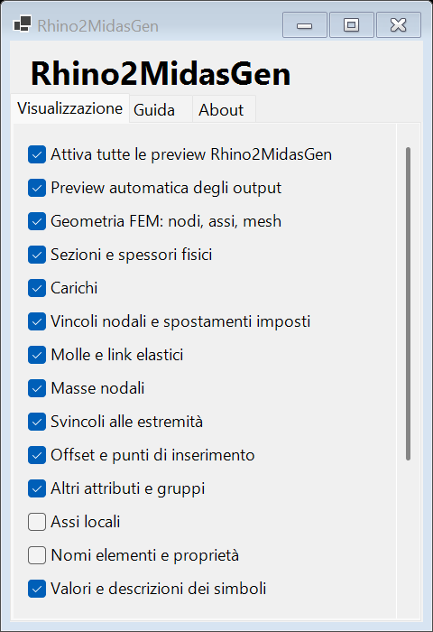

# Preview, Brep e bake

`Preview Midas GEN Model` accetta Model, frammenti e sezioni. Il menu Rhino2MidasGen e il tasto destro dei componenti aprono Visualizzazione, Guida e About. `Midas GEN Display Settings` permette impostazioni per un singolo Model. L'interruttore globale spegne tutte le preview del plugin. Il gestore sopprime le anteprime dei componenti Rhino2MidasGen collegati a monte senza cambiarne Hidden; eventuali parametri generici esterni seguono le regole di Grasshopper.

Sono presenti assi/mesh FEM, sezioni estruse, spessori, carichi, vincoli, molle, masse, svincoli, offset, etichette e assi locali. I simboli rappresentano le assegnazioni; non indicano stabilità né avvenuta analisi. Il filtro carichi usa il nome LCNAME. Le frecce dei momenti sono identificate dalla lettera M.

## Solidi

`Breps` restituisce copie di volumi chiusi. È possibile collegarli a un parametro Brep e fare Bake, oppure usare `Bake Midas GEN Geometry` con `Physical=true`. Il cast diretto funziona quando il frammento contiene esattamente un solido ricostruibile. La conversione resta disponibile a preview spenta.

- Profili utente SB, SR, P, B, H, T, C, L, inclusi vuoti di tubi e scatolari.
- Punti di inserimento standard, orientamento beta e un offset attivo alle estremità.
- Piastre e pareti piane con spessore T_IN e offset normale.
- Solidi FEM a 4, 6 e 8 nodi.

Sezioni database prive delle dimensioni geometriche, PSC/composite, profili raccordati, variazioni lungo la trave, piastre irrigidite e offset multipli legati alle fasi non sono trasformati in solidi esatti. `Issues` indica le omissioni; non viene restituita un'approssimazione etichettata come solido esatto.

I carichi nodali su nodi con SKEW non vengono disegnati in una direzione globale presunta: la limitazione viene segnalata. I simboli avanzati restano schematici; per i dettagli delle opzioni native usare GEN. Le deformate derivano dagli spostamenti nodali globali e interpolano gli estremi delle travi, senza ricostruire la deformazione interna da curvature.

Il beta dei membri verticali segue GEN: a beta zero, z locale coincide con X globale. Per gli altri membri, y locale deriva da Z globale × x locale. Gli allineamenti impostano y locale delle travi e x locale delle piastre.
