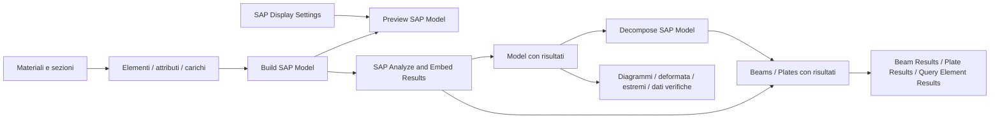

# Rhino2SAP

Plugin **Grasshopper per Rhino 8 / .NET 8 / Windows x64**, costruito con la stessa organizzazione di Rhino2Straus e con l'API **SAP2000 26** installata sul computer.

**565 componenti**, con icone proprie a 24 px: materiali, sezioni, proprietà, nodi, beam, plate, solidi, link e cable; carichi, attributi, casi e combinazioni; Model, esportazione, analisi, risultati, interrogazione e visualizzazione.

La scheda **SAP2000** di Grasshopper è organizzata in **34 pannelli per argomento**, con titoli in italiano e numerazione ordinata. Sezioni beam, Section Designer, piastre/solidi, link/cavi, vincoli, assi/offset e masse hanno gruppi dedicati. Carichi, analisi e risultati sono ulteriormente separati per tipo: carichi nodali/beam/plate, vento e sisma, casi statici/non lineari, fasi costruttive, modale, time history, risultati nodali/beam/plate/solidi-link. **33 Preview e bake** raccoglie visualizzazione, Brep e bake; **26 Analisi e file** raccoglie esecuzione e import/export. Il catalogo seguente rispecchia gli stessi pannelli.

[Catalogo](docs/COMPONENTS.md) · [Analisi e risultati negli elementi](docs/ANALYSIS-RESULTS.md) · [Preview e pannello](docs/PREVIEW.md) · [Corrispondenze Straus](docs/STRAUS-PARITY.md) · [Verifiche e limiti](docs/VALIDATION.md) · [Icone](docs/icons.png).

## Flusso



`Definitions` raccoglie le dipendenze dei componenti API. Collegare un materiale al socket `MatProp` di una sezione, e la sezione al socket `Property` dell'elemento, conserva automaticamente le definizioni. I socket di nome accettano anche stringhe: in quel caso includere le definizioni necessarie in Build Model. Tutti gli oggetti sono costruiti senza avviare SAP. Gli attributi producono nuove definizioni; gli input restano invariati.

`Build SAP Model` raccoglie anche i nodi impliciti, salda la connettività secondo la tolleranza e controlla i nomi duplicati. `Merge SAP Models` richiede unità e tolleranza uguali e rifiuta nomi in conflitto. Una stessa dipendenza condivisa non viene applicata due volte; contributi di carico creati separatamente rimangono separati. Per sommare carichi nativi verificare `Replace=false`: i componenti API conservano il default documentato da CSI.

Per il **bake solido**, collegare l'uscita **Breps** di `Preview SAP Model` a un parametro Brep e usare Bake. Sono disponibili anche il cast diretto dei singoli elementi e `Bake SAP Geometry` con `Physical=true` e `Solid only=true`, che conserva i nomi SAP. La conversione funziona a preview spenta; le forme non ricostruibili sono indicate in Issues. [Dettagli](docs/PREVIEW.md#brep-e-bake-solido).

## Installazione

1. Eseguire `./build.ps1` oppure usare `artifacts/Rhino2SAP.zip`.
2. Copiare **il contenuto di bin (o i file nella radice dello ZIP)** in una cartella Rhino2SAP in Grasshopper → File → Special Folders → Components Folder.
3. Sbloccare i file scaricati, se necessario, e riavviare Rhino 8 in modalità .NET 8.
4. SAP2000 viene cercato in `C:\Program Files\Computers and Structures\SAP2000 *`. Per un percorso diverso impostare `SAP2000_PATH` alla cartella dell'installazione o a `SAP2000.exe`.

Il pacchetto comprende `.gha`, Core, Api e **Worker** con i relativi file di runtime. Il worker usa `dotnet` e un processo SAP separato; non collegarsi soltanto al `.gha`. Gli SDK proprietari Rhino/Grasshopper/CSI e i manuali rimangono nelle rispettive installazioni.

## Analisi

Collegare un Model a **SAP Analyze and Embed Results**, scegliere un percorso `.sdb` e portare `Run` da false a true. Il componente crea il file, seleziona i casi, avvia SAP, verifica lo stato dei casi, rilegge le quantità e restituisce il Model insieme ai beam e plate con `Element.Results` incorporato. Anche `Run SAP Model Cases and Combinations` usa lo stesso flusso. Per la sola scrittura usare `Export SAP2000 Model`.

Le modifiche agli input non rilanciano automaticamente SAP. `Overwrite=false` è il default. La scrittura avviene prima in una cartella temporanea; modello e sidecar sono pubblicati solo dopo il completamento. Le chiamate avvengono nel worker: timeout avvio 120 secondi, analisi 30 minuti. Il calcolo è sincrono per Grasshopper ma il blocco di avvio è limitato e il processo isolato viene terminato al timeout.

**Stato del collaudo nativo:** nell'ambiente attuale SAP si ferma in `ApplicationStart`. Build, test gestiti, caricamento e collegamenti Grasshopper sono verificati; il calcolo numerico nel solver SAP non è ancora stato completato qui. I dettagli sono in [VALIDATION](docs/VALIDATION.md).

## Importare un modello esistente

Per i file esistenti, **Import SAP Model** restituisce un Model associato a un `.sdb`, con unità, geometria, proprietà supportate, casi, combinazioni e hash della sorgente. Preview e decomposizione usano la vista GH; export e analisi conservano tutte le definizioni native lavorando su una copia verificata del file. La sorgente rimane di sola lettura: per modificarla, editarla in SAP e reimportare. [Dettagli e limiti](docs/IMPORT-MODEL.md) · [Esempio 32](examples/32_Import_modello_SAP_associato.gh).

**SAP File Paths** collega automaticamente il file prodotto dal run al suo archivio dei risultati. Sono disponibili anche le nuove definizioni di funzioni utente per spettro, time history, risposta armonica e PSD.

## Unità e convenzioni

- Tutti i dati dimensionali usano le unità del Model, secondo `SAP2000v1.eUnits`: **6 = kN_m_C**, **9 = N_mm_C**. Le coordinate Rhino non sono convertite implicitamente.
- E e tensioni: F/L²; densità di peso: F/L³; momenti: F·L; risultanti shell F11/F22/F12/V13/V23: F/L; momenti shell: F·L/L. Le deformazioni sono adimensionali; spostamenti L e rotazioni di risultato radianti.
- Angoli di assegnazione dell'API in gradi. Assi e segni dei risultati restano quelli nativi SAP. `P` è la forza assiale del beam; il lettore dedicato la espone come **N (P)**.
- `obj` e `Obj` sono trattati allo stesso modo nei risultati, perché l'SDK usa entrambe le grafie. Identificativi e nomi dei casi sono invece conservati.
- I risultati nodali sono in assi locali del nodo. La deformata li converte in globali con la matrice nativa CSI salvata durante l'analisi.

## Esempi Grasshopper

In [examples](examples/README.md) sono disponibili **42 definizioni** `.gh` e `.ghx` che coprono tutti i **34 gruppi**: frame, mesh, piastre, solidi, link, cavi, materiali e sezioni, vincoli, assi e offset, masse, carichi, casi statici/non lineari/dinamici, export, import, analisi, risultati, query, preview e bake. Ogni esempio ha una guida, note sul canvas e un PNG. [Galleria ricercabile](examples/index.html). Run/Bake sono inizialmente disattivati e i lettori dei risultati restano in attesa del calcolo. Lo ZIP dedicato è `artifacts/Rhino2SAP_Examples.zip`.

Per rigenerarli dopo una build Release, eseguire `./tools/Generate-Examples.ps1`. Il generatore riapre entrambi i formati, verifica fili/modelli/Brep e pubblica un rapporto in `examples/validation.json`; non esegue SAP.

## Sviluppo

```powershell
./tools/Inspect-Sdk.ps1
./tools/Generate-Components.ps1
./build.ps1
dotnet run --project Rhino2SAP.Tests -c Release
dotnet run --project tools/PluginSmoke -c Release
./tools/Update-Catalogue.ps1
./tools/Generate-Icons.ps1
./build.ps1 -RhinoSmoke
```

`PluginSmoke` aggiorna il catalogo con i nomi, le categorie e i GUID effettivamente caricati in Rhino. `Inspect-Sdk` registra 2.047 firme dalla DLL locale; la provenienza e l'hash sono in `docs/sdk-source.json`. La documentazione usata è `CSI_OAPI_Documentation.chm`, inclusi l'esempio C# 26, le convenzioni di carico, la matrice locale/globale, gli assi avanzati e lo stato dell'analisi.

`ComponentTopics.cs` definisce i pannelli condivisi da componenti API e componenti di uso comune. La rigenerazione dei componenti mantiene questa classificazione. Nomi e GUID restano stabili: i componenti si spostano nel ribbon senza cambiare identità nei file Grasshopper esistenti.

## Compilazione e pulizia

`./build.ps1` crea nella directory di questo progetto una sola cartella **`bin`** pronta per Grasshopper: un file `.gha` e le DLL/runtime necessari. Non cambiare i GUID per risolvere caricamenti doppi.

La build elimina i vecchi `bin/obj` intermedi, ricrea il contenuto di `bin`, esegue i test e rimuove di nuovo gli intermedi anche in caso di errore. Conserva in `artifacts` lo ZIP della versione corrente; elimina i vecchi ZIP del plugin e le vecchie distribuzioni estratte. Gli archivi degli esempi restano disponibili. Documentazione ed esempi sono nei sorgenti e nello ZIP, senza duplicati nella cartella `bin`.

- `./clean.ps1 -WhatIf`: mostra cosa verrebbe rimosso.
- `./clean.ps1`: pulisce gli intermedi e i vecchi pacchetti, conservando `bin`.
- `./build.ps1 -KeepBuildOutputs`: conserva gli intermedi per debug/sviluppo; al termine usare `./clean.ps1`.
- `./build.ps1 -SkipTests`: compila e pulisce saltando i test gestiti.

Caricare **solo questa cartella `bin`** tramite GrasshopperDeveloperSettings, oppure copiarne l'intero contenuto in un'unica cartella delle Libraries di Grasshopper. Usare una sola delle due modalità e sostituire l'installazione precedente: caricare contemporaneamente copie installate, `bin` e vecchi pacchetti genera duplicati. Le DLL accanto al `.gha` sono necessarie. Chiudere Rhino prima di ricompilare se i file sono in uso.

Gli strumenti Rhino.Inside di verifica/generazione esempi leggono il plugin da `bin`: eseguire prima `./build.ps1`. Dopo l'uso dei tool, `./clean.ps1` rimuove anche i loro intermedi.
