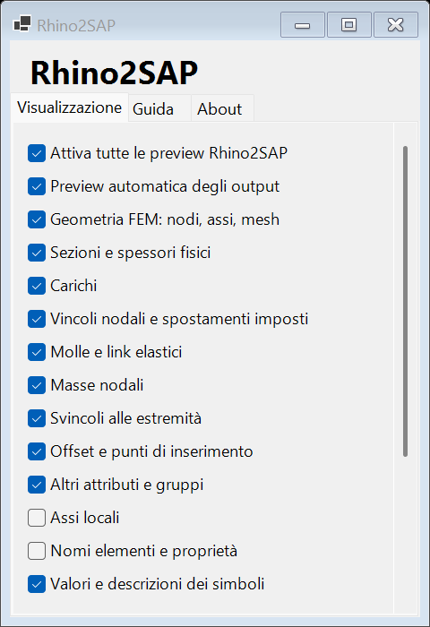

# Preview e impostazioni

Il menu **Rhino2SAP** nella barra superiore di Grasshopper apre una finestra non modale con tre pagine: **Visualizzazione**, **Guida**, **About**. La stessa finestra si apre dal menu contestuale del componente **Rhino2SAP Panel**. Le preferenze globali vengono conservate nelle impostazioni Grasshopper.

## Interruttori

Ogni categoria è disattivabile: preview generale, preview automatica dei Goo, geometria FEM, sezioni/spessori, carichi, vincoli, molle/link, masse, svincoli, offset, altri attributi/gruppi, assi, nomi e valori. Sono disponibili scala dei simboli, scala dei carichi e filtro per nome di load pattern.

Il comando generale disattiva anche le preview dedicate. Il comando **Automatic** riguarda soltanto gli output Model/elementi/sezioni. Il normale comando Preview/Hide di Grasshopper resta disponibile sul singolo componente.

Per un controllo locale: `SAP Display Settings → Preview SAP Model`. Questo percorso non modifica le preferenze globali. Disabilitare la preview del componente Build quando si usa una preview dedicata, per evitare sovrapposizioni.

## Brep e bake solido

`Preview SAP Model` espone **Breps (B)** e **Brep Names (N)**. Sono Brep Rhino validi, chiusi e orientati verso l'esterno: sezioni estruse dei beam, plate con spessore ed elementi solidi. I nomi SAP corrispondono ai Brep nello stesso ordine. Per una sezione isolata viene restituito il provino della preview, lungo 0,1 nelle unità del modello.

Per fare il bake:

1. Collegare il modello a **Preview SAP Model**.
2. Collegare **Breps** a un parametro **Brep** di Grasshopper.
3. Usare **Bake** dal menu contestuale del parametro, oppure direttamente dal componente Preview.

In alternativa, **Bake SAP Geometry** con `Physical=true`, `Solid only=true` e un impulso `Bake: false → true` crea soltanto solidi, conserva i nomi SAP negli oggetti Rhino e raggruppa il bake in un'operazione annullabile. `Solid only=false` conserva il comportamento misto, con geometria di analisi dove la forma fisica non è disponibile; `Physical=false` produce la sola geometria di analisi. L'uscita **Issues** riporta le limitazioni dell'ultimo bake.

È disponibile anche il **cast diretto a Brep** di un elemento o di un modello con un solo elemento fisico, incluse le sezioni isolate. Gli elementi restituiti da Decompose Model e Analyze conservano le definizioni necessarie al cast. Per un modello con più elementi usare l'uscita Breps della preview: un cast a un solo Brep non scarta gli altri elementi e non esegue unioni booleane implicite.

Gli interruttori di visualizzazione non svuotano l'uscita Breps: la conversione e il bake funzionano anche a preview spenta. Un parametro Brep esterno usa la normale preview Grasshopper, controllabile separatamente. I nodi e i simboli di carichi/attributi non diventano solidi. Gli elementi senza una forma fisica ricostruibile sono omessi dall'uscita Breps e indicati in Issues; non vengono sostituiti con mesh aperte o assi. Il bake non richiede l'avvio di SAP.

## Rappresentazione

| Oggetto | Preview |
|---|---|
| Nodi/frame/area/solidi/link/cable | Punti, assi e mesh |
| Sezioni | Estrusioni esatte delle forme implementate; anche una sezione isolata produce un piccolo provino all'origine |
| Piastre | Spessore della shell quando definito e senza offset avanzati |
| Forze e momenti nodali | Frecce e archi, con componenti e pattern |
| Carichi frame puntuali e distribuiti | Posizioni relative/assolute, andamento lineare e direzioni ricostruibili |
| Carichi uniformi area | Frecce campionate su area e baricentro |
| Vincoli | Simbolo di appoggio ed elenco dei DOF |
| Molle/link e masse | Zigzag, marcatori e valori |
| Svincoli | Anelli alle estremità e DOF rilasciati |
| Offset | Segmenti fra asse e posizione assegnata; cardinal point indicato |
| Assi locali | Rosso 1, verde 2, blu 3; supporto ai vettori globali degli assi avanzati |
| Altri carichi/attributi | Simboli con metodo e valori nativi, senza dedurre direzioni non documentate |

**Limiti espliciti:** profili fisici Rectangle, Circle, Pipe, Tube, ISection, Tee, Channel, Angle; forme avanzate, sezioni generiche e offset complessi mantengono la geometria di analisi con un messaggio Issues. Le pressioni su facce, temperature, strain/preload e sistemi di coordinate non ricostruiti sono rappresentati simbolicamente con i valori. Anche i carichi proiettati mantengono il codice di direzione senza una freccia potenzialmente fuorviante.

Le impostazioni cambiano solo il disegno. Non modificano geometria, carichi, unità o risultati. I risultati hanno strumenti separati per diagrammi e deformata.
